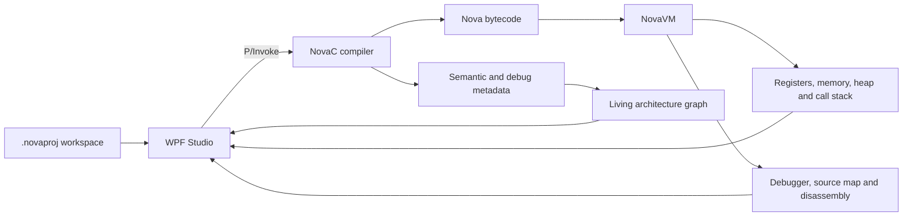

<p align="center">
  
</p>

# Nova Studio

[Türkçe](README.tr.md)

Nova Studio is a Windows-first systems programming workbench that makes a C
program visible from source code to execution. It combines a bounded C compiler,
a bytecode virtual machine, a native debugger, and a live architecture graph in
one desktop application.

The project is intentionally not a replacement for a general-purpose IDE or a
fully conforming ISO C toolchain. Its purpose is to expose the normally hidden
links between source files, compiler metadata, generated bytecode, VM state,
memory, and control flow.


*Actual WPF interface rendered from the Release build with the included sample workspace; not a mock-up.*

> **Project context:** Nova Studio is an independent engineering project
> developed while I was a high-school student. The repository keeps the claims
> deliberately verifiable: the toolchain, tests, source, and validation boundary
> are all available below.

## What it demonstrates

- A native C11 compiler and VM with stable C ABIs.
- Multi-file project compilation with headers, declarations, macros, and source
  metadata.
- Deterministic, fixed-capacity compiler data structures and an OS-backed,
  per-compilation workspace.
- Registers, memory, heap, stack frames, breakpoints, stepping, disassembly, and
  source maps surfaced through a .NET 8 WPF frontend.
- A live graph that connects project files, functions, globals, declarations,
  includes, calls, and the active runtime path.
- 22 native/compiler regression tests built with warnings treated as errors.

## How the workbench is put together

The project is split at a deliberate native/desktop boundary. `compiler/`
turns the included multi-file C workspace into bytecode and source/debug
metadata; `native/` executes that bytecode through a C ABI; `studio/` presents
both through WPF and P/Invoke. The UI is a view of the toolchain's state, not a
separate visual model of a program.

That shared metadata is the key implementation decision. A build supplies the
symbols and source mappings used by the debugger as well as the file, function,
include, and call relationships used by the graph. During execution, VM state
adds the active path, registers, stack, memory, and disassembly. Keeping these
views tied to the same compiled workspace makes a small sample useful for
inspecting the entire source-to-runtime path. Fixed capacities and unsupported
C features remain explicit rather than suggesting full language conformance.

## System overview



See [Architecture](docs/ARCHITECTURE.md) for the component boundaries and data
flow.

## Inside one build-and-debug cycle

Opening a `.novaproj` file gives the Studio a concrete workspace: project-local
C sources and headers plus saved graph positions. On **Build**, the WPF layer
passes source buffers across the native ABI to NovaC. The frontend produces
bytecode, diagnostics, symbols, source maps, and relationship records in one
compilation. The graph is assembled from those records; it does not infer calls
or includes from text shown in an editor. A failed or unsupported construct is
reported at this compilation boundary instead of silently becoming a graph
node or executable instruction.

The resulting bytecode is loaded into a fresh NovaVM instance. The runtime has
16 explicit 32-bit registers and a 1 MiB address space divided into regions
for globals, heap, stack, and MMIO. Breakpoints and step commands advance this
VM, while the Studio reads PC/SP/flags, call frames, memory, heap information,
and runtime events through its public ABI. Console output is an MMIO event, so
the UI can show it alongside the instruction and source location that produced
it. Source maps join those runtime observations back to the compiler result.

The architecture view therefore answers a different question from a static
diagram: which file/function relationships were compiled, and which path is
active *now*? The debugger answers what the VM is doing at that point. The
included sample and 22 CTest cases make this interaction reproducible, while
the stated language limits keep it distinct from a production C compiler.

### Where to read the implementation

| File | What to inspect |
| --- | --- |
| [`compiler/src/nova_compiler.c`](compiler/src/nova_compiler.c) | Multi-file frontend and bytecode/metadata production. |
| [`compiler/include/nova_compiler.h`](compiler/include/nova_compiler.h) | Caller-facing compiler ABI and output contract. |
| [`native/src/nova_vm.c`](native/src/nova_vm.c) | Instruction execution, runtime state, and debugger behavior. |
| [`native/include/nova_vm.h`](native/include/nova_vm.h) | Public VM state and inspection ABI. |
| [`studio/Services/NovaWorkspaceService.cs`](studio/Services/NovaWorkspaceService.cs) | Workspace compilation and native-to-WPF coordination. |
| [`studio/MainWindow.xaml.cs`](studio/MainWindow.xaml.cs) | Desktop interaction and runtime views. |
| [`compiler/tests/test_compiler.c`](compiler/tests/test_compiler.c) | Frontend regression cases. |

## A 60-second product tour

1. Launch Nova Studio and open `examples/PersistentWorkspace/NovaDemo.novaproj`.
2. Build the workspace to populate compiler diagnostics, symbols, source maps,
   bytecode, and the architecture graph from the same compilation result.
3. Select a function or file in the graph to trace includes and calls instead of
   reading the project as disconnected text files.
4. Set a breakpoint, run, then step through bytecode while watching registers,
   stack frames, memory, disassembly, and the active graph path move together.
5. Inspect the console event view to confirm that the included sample emits `A`.

This path is intentionally small and reproducible: it shows the compiler, VM,
debugger, native interop, and visualization layer working as one system.

## Build on Windows

### Prerequisites

- Windows 10 or later, x64
- Visual Studio 2022 with the Desktop development with C++ workload
- CMake 3.20 or later
- .NET 8 SDK or a newer SDK capable of targeting .NET 8

From an x64 Visual Studio Developer PowerShell:

```powershell
cmake -S . -B build -A x64
cmake --build build --config Release
ctest --test-dir build -C Release --output-on-failure
dotnet build studio/NovaStudio.csproj -c Release
```

The root CMake project places the native runtime files directly in `build/` so
the WPF project can copy them beside `NovaStudio.exe`:

- `build/nova_vm.dll`
- `build/nova_compiler.dll`
- `build/novac.exe`
- `studio/bin/Release/net8.0-windows/NovaStudio.exe`

Launch the Studio after a successful build:

```powershell
dotnet run --project studio/NovaStudio.csproj -c Release
```

Open `examples/PersistentWorkspace/NovaDemo.novaproj` for the multi-file sample.

## Repository layout

| Path | Purpose |
| --- | --- |
| `native/` | NovaVM implementation, public ABI, and VM tests |
| `compiler/` | NovaC frontend, bytecode generation, CLI, and compiler tests |
| `studio/` | .NET 8 WPF desktop application and native interop |
| `examples/` | Persistent multi-file sample workspace |
| `docs/` | Architecture, schema, validation evidence, and development notes |

## Validation status

The v0.21 source candidate in this repository has been verified on Windows with
an MSVC Release build, all 22 CTest cases, a clean .NET 8 WPF build, runtime
payload checks, and a `novac` compile of the persistent sample workspace.

See [Validation evidence](docs/VALIDATION.md) for the reproducible record and
current validation boundary.

## Scope boundaries

NovaC implements the language surface required by the included samples and
regression suites. It is a deliberately bounded compiler: fixed capacities,
quoted project-local includes, and explicit unsupported-feature diagnostics are
part of the design. It should not be represented as a complete ISO C compiler.

Nova Studio is currently Windows-first because its desktop shell is WPF. The
native compiler and VM are kept behind C ABIs and are also exercised with GCC and
Clang during portability work.

## Version

Current portfolio release: **0.21.0**.

## License

Licensed under the [MIT License](LICENSE).

Small, reviewable changes are welcome; see [CONTRIBUTING.md](CONTRIBUTING.md) for
the local quality gate.
