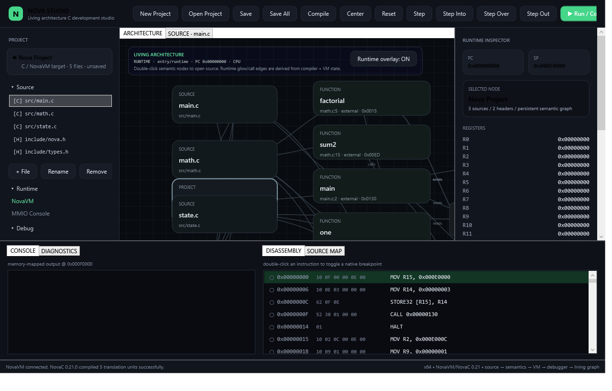
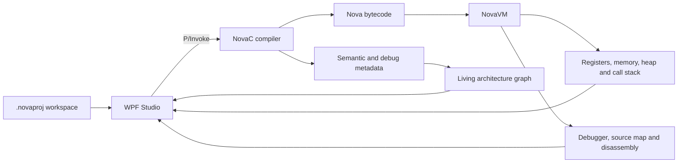

<p align="center">
  
</p>

# Nova Studio

[English](README.md)

Nova Studio, bir C programının kaynak koddan çalışmaya uzanan yolunu görünür kılan, öncelikle Windows için geliştirilmiş bir sistem programlama ortamıdır. Sınırları belirli bir C compiler, bytecode VM, native debugger ve canlı mimari grafiğini tek masaüstü uygulamasında birleştirir.

Genel amaçlı bir IDE veya ISO C standardına bütünüyle uyan bir toolchain olmayı hedeflemez. Amaç; kaynak dosyalar, compiler metadata’sı, üretilen bytecode, VM durumu, bellek ve kontrol akışı arasındaki normalde görünmeyen bağlantıları incelemektir.



*Dâhil edilen örnek workspace ile Release build’den alınmış gerçek WPF arayüzü; mock-up değildir.*

> **Proje bağlamı:** Nova Studio, lise yıllarımda geliştirdiğim bağımsız bir mühendislik projesidir. Toolchain, testler, kaynak kod ve doğrulama sınırları bu repoda incelenebilir.

## Neyi gösteriyor?

- Kararlı C ABI’leri üzerinden çalışan native C11 compiler ve VM.
- Header, declaration, macro ve kaynak metadata’sı içeren çok dosyalı proje derlemesi.
- Deterministik, sabit kapasiteli compiler veri yapıları ve her derleme için işletim sistemi destekli çalışma alanı.
- .NET 8 WPF arayüzünden izlenebilen register, bellek, heap, stack frame, breakpoint, adımlama, disassembly ve source map.
- Proje dosyalarını, fonksiyonları, global değişkenleri, declaration’ları, include/call ilişkilerini ve etkin çalışma yolunu bağlayan canlı grafik.
- Uyarıların hata sayıldığı build’de çalışan 22 native/compiler regresyon testi.

## Çalışma ortamı nasıl kuruldu?

Proje, native toolchain ile masaüstü arayüzü arasında bilinçli bir sınıra
ayrılır. `compiler/`, repodaki çok dosyalı C workspace’inden bytecode ve
kaynak/debug metadata’sı üretir; `native/` bytecode’u C ABI üzerinden
çalıştırır; `studio/` ise ikisini WPF ve P/Invoke ile görünür kılar. Arayüz,
programın ayrı hazırlanmış bir çizimi değil, toolchain’in gerçek durumuna
bağlıdır.

Buradaki temel karar aynı metadata’yı farklı görünümlerde kullanmaktır.
Derleme sonucu debugger’ın sembol ve source map bilgilerini, grafiğin de
dosya, fonksiyon, include ve call ilişkilerini besler. Çalışma sırasında VM
durumu etkin yolu, register’ları, stack’i, belleği ve disassembly’yi ekler.
Böylece küçük bir örnek, kaynak koddan runtime’a uzanan zinciri incelemek
için yeterli olur. Sabit kapasiteler ve desteklenmeyen C özellikleri açıkça
belirtilir; tam dil uyumu ima edilmez.

## Sisteme genel bakış



Bileşen sınırları ve veri akışı için [mimari notlarına](docs/ARCHITECTURE.md) bakın.

## Bir build ve debug döngüsünün içinde

Bir `.novaproj` dosyası açıldığında Studio; projeye ait C kaynaklarını,
header’ları ve kayıtlı grafik konumlarını içeren somut bir workspace yükler.
**Build** sırasında WPF katmanı kaynak buffer’larını native ABI üzerinden
NovaC’ye iletir. Frontend aynı derlemede bytecode, tanılar, semboller, source
map’ler ve ilişki kayıtları üretir. Grafik bu kayıtlardan kurulur; editördeki
metne bakıp call veya include ilişkisi tahmin etmez. Desteklenmeyen bir yapı
sessizce grafiğe ya da çalıştırılabilir koda dönüşmez, derleme sınırında
bildirilir.

Üretilen bytecode yeni bir NovaVM örneğine yüklenir. Runtime’da 16 adet açık
32-bit register ve globals, heap, stack ile MMIO bölgelerine ayrılmış 1 MiB
adres alanı vardır. Breakpoint ve step komutları VM’i ilerletirken Studio,
PC/SP/flags durumunu, call frame’leri, belleği, heap bilgisini ve runtime
olaylarını public ABI üzerinden okur. Konsol çıktısı MMIO olayı olarak
modellendiğinden, arayüz çıktıyı onu üreten komut ve kaynak konumuyla
birlikte gösterebilir. Source map’ler çalışma gözlemlerini derleme sonucuna
geri bağlar.

Mimari görünüm bu yüzden statik bir diyagramdan farklı bir soruyu yanıtlar:
hangi dosya/fonksiyon ilişkileri derlendi ve *şu anda* hangi yol etkin?
Debugger ise VM’in o noktada ne yaptığını gösterir. Dâhil edilen örnek ve 22
CTest vakası bu etkileşimi tekrar üretilebilir kılar; belirtilen dil sınırları
da projeyi üretim amaçlı bir C compiler’dan ayırır.

### Kodu nereden okumalı?

| Dosya | İncelenecek konu |
| --- | --- |
| [`compiler/src/nova_compiler.c`](compiler/src/nova_compiler.c) | Çok dosyalı frontend ve bytecode/metadata üretimi. |
| [`compiler/include/nova_compiler.h`](compiler/include/nova_compiler.h) | Dışarıya açık compiler ABI’si ve çıktı sözleşmesi. |
| [`native/src/nova_vm.c`](native/src/nova_vm.c) | Komut yürütme, runtime durumu ve debugger davranışı. |
| [`native/include/nova_vm.h`](native/include/nova_vm.h) | Public VM durumu ve inceleme ABI’si. |
| [`studio/Services/NovaWorkspaceService.cs`](studio/Services/NovaWorkspaceService.cs) | Workspace derlemesi ve native/WPF koordinasyonu. |
| [`studio/MainWindow.xaml.cs`](studio/MainWindow.xaml.cs) | Masaüstü etkileşimi ve runtime görünümleri. |
| [`compiler/tests/test_compiler.c`](compiler/tests/test_compiler.c) | Frontend regresyon vakaları. |

## 60 saniyelik ürün turu

1. Nova Studio’yu başlatıp `examples/PersistentWorkspace/NovaDemo.novaproj` dosyasını açın.
2. Workspace’i build ederek compiler tanılarını, sembolleri, source map’leri, bytecode’u ve mimari grafiği aynı derleme sonucundan oluşturun.
3. Dosyalar ve çağrılar arasındaki ilişkileri izlemek için grafikte bir fonksiyon veya dosya seçin.
4. Breakpoint koyup programı çalıştırın; bytecode üzerinde adımlarken register’ları, stack frame’leri, belleği, disassembly’yi ve etkin grafik yolunu birlikte izleyin.
5. Örneğin `A` çıktısını ürettiğini konsol olay görünümünden doğrulayın.

Bu küçük, tekrarlanabilir akış compiler, VM, debugger, native interop ve görselleştirmenin birlikte çalışmasını gösterir.

## Windows üzerinde build

### Gereksinimler

- Windows 10 veya üzeri, x64
- Desktop development with C++ workload’u kurulu Visual Studio 2022
- CMake 3.20 veya üzeri
- .NET 8 SDK veya .NET 8’i hedefleyebilen daha yeni bir SDK

x64 Visual Studio Developer PowerShell içinde:

```powershell
cmake -S . -B build -A x64
cmake --build build --config Release
ctest --test-dir build -C Release --output-on-failure
dotnet build studio/NovaStudio.csproj -c Release
```

Kök CMake projesi native runtime dosyalarını doğrudan `build/` altına koyar; WPF projesi bunları `NovaStudio.exe` yanına kopyalar:

- `build/nova_vm.dll`
- `build/nova_compiler.dll`
- `build/novac.exe`
- `studio/bin/Release/net8.0-windows/NovaStudio.exe`

Başarılı build sonrasında uygulamayı açın:

```powershell
dotnet run --project studio/NovaStudio.csproj -c Release
```

Çok dosyalı örnek için `examples/PersistentWorkspace/NovaDemo.novaproj` dosyasını açın.

## Repo yapısı

| Yol | Görev |
| --- | --- |
| `native/` | NovaVM uygulaması, public ABI ve VM testleri |
| `compiler/` | NovaC frontend, bytecode üretimi, CLI ve compiler testleri |
| `studio/` | .NET 8 WPF masaüstü uygulaması ve native interop |
| `examples/` | Kalıcı, çok dosyalı örnek workspace |
| `docs/` | Mimari, şema, doğrulama kanıtı ve geliştirme notları |

## Doğrulama durumu

Bu repodaki v0.21 kaynak adayı Windows’ta MSVC Release build, 22/22 CTest, temiz .NET 8 WPF build, runtime dosya kontrolleri ve örnek workspace’in `novac` ile derlenmesi üzerinden doğrulandı.

Tekrarlanabilir kayıt ve doğrulama sınırı için [doğrulama kanıtına](docs/VALIDATION.md) bakın.

## Kapsam sınırları

NovaC, dâhil edilen örnek ve regresyon testlerinin gerektirdiği dil yüzeyini uygular. Bilinçli olarak sınırlı bir compiler’dır: sabit kapasiteler, proje içi quoted include’lar ve desteklenmeyen özellikler için açık tanılar tasarımın parçasıdır. Tam bir ISO C compiler olarak sunulmamalıdır.

Masaüstü kabuğu WPF olduğu için Nova Studio şu anda öncelikle Windows’a yöneliktir. Native compiler ve VM, C ABI’lerinin arkasında tutulur; taşınabilirlik çalışmalarında GCC ve Clang ile de sınanır.

## Sürüm

Güncel portföy sürümü: **0.21.0**.

## Lisans

[MIT Lisansı](LICENSE) altında yayımlanır.

Küçük ve incelenebilir değişiklikler için yerel kalite kapıları [CONTRIBUTING.md](CONTRIBUTING.md) dosyasında yer alır.
